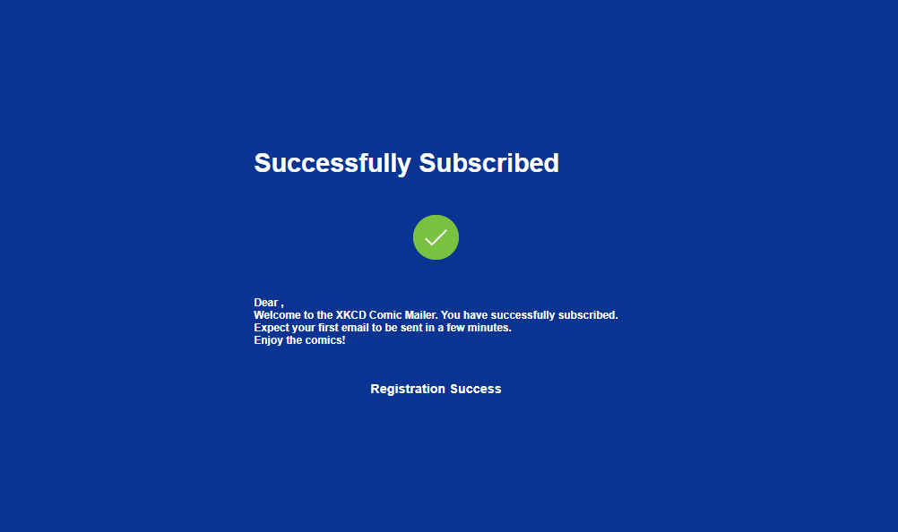
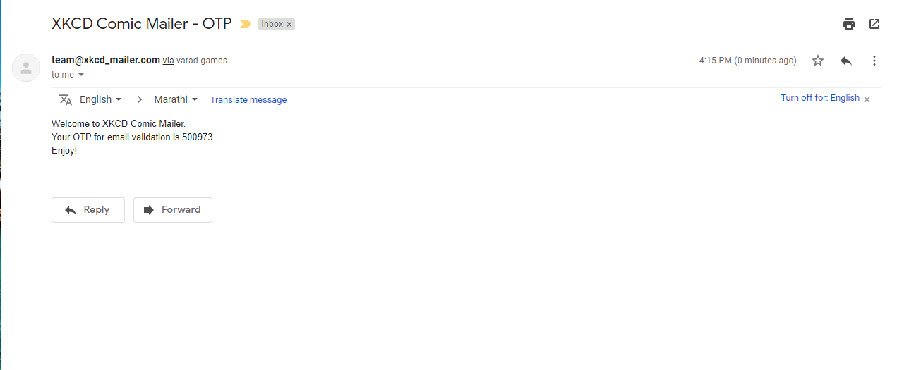

# XKCD Comic Mailer RTCamp

## XKCD Mailer Project for RTCamp Assignment   Built using HTML, JavaScript, CSS, JQuery, PHP and MySQL  Get XKCD Comics in your inbox every 5 minutes

<object width="425" height="350">
  <param name="movie" value="https://www.youtube.com/watch?v=3wE1-IezToo&feature=youtu.be" />
  <param name="wmode" value="transparent" />
  <embed src="https://www.youtube.com/watch?v=3wE1-IezToo&feature=youtu.be"
         type="application/x-shockwave-flash"
         wmode="transparent" width="425" height="350" />
</object>

### 1.Enter Email

### 2.Get OTP on Mail

### 3.Enter Personal Details

### 4.Finalize Subscription

### 5.Enjoy Comics on Mail

### 6.Unsubscribe With Ease

